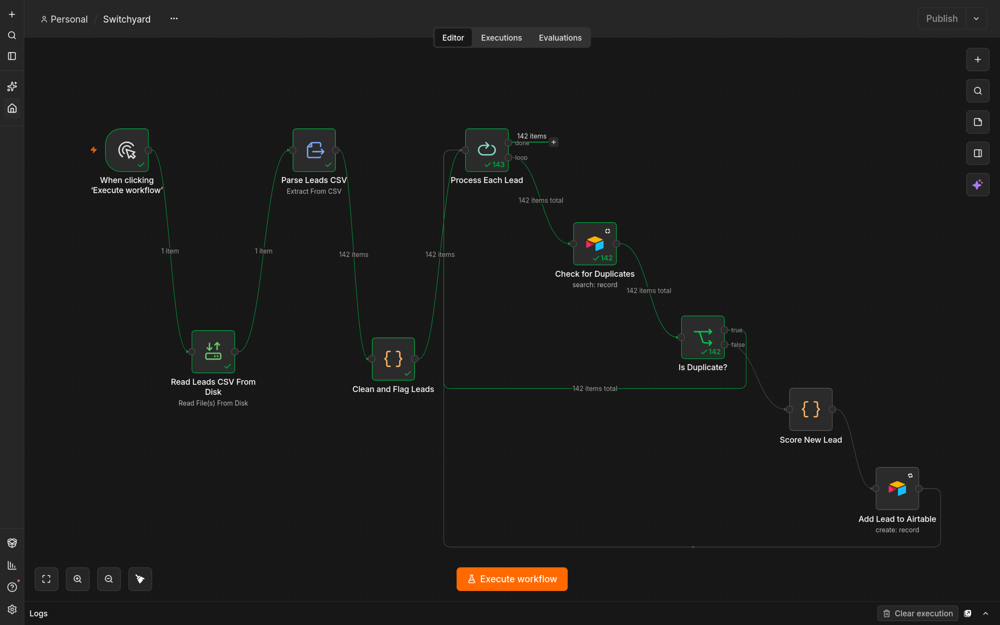
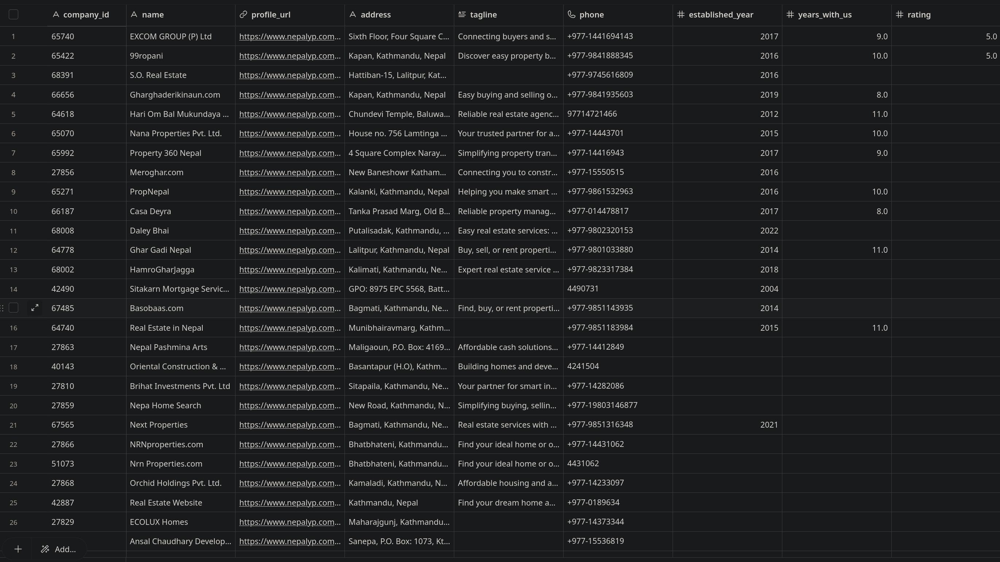
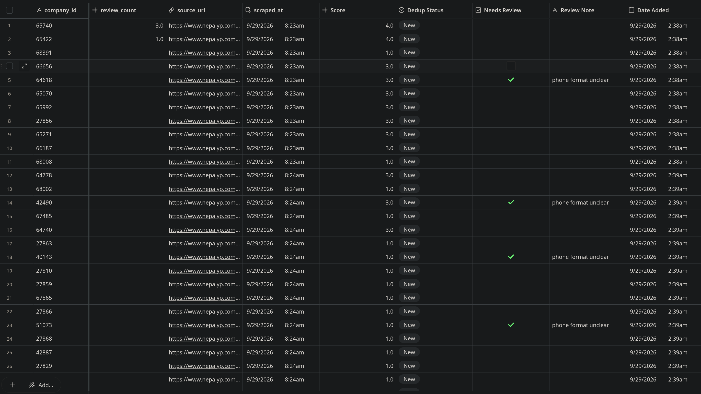
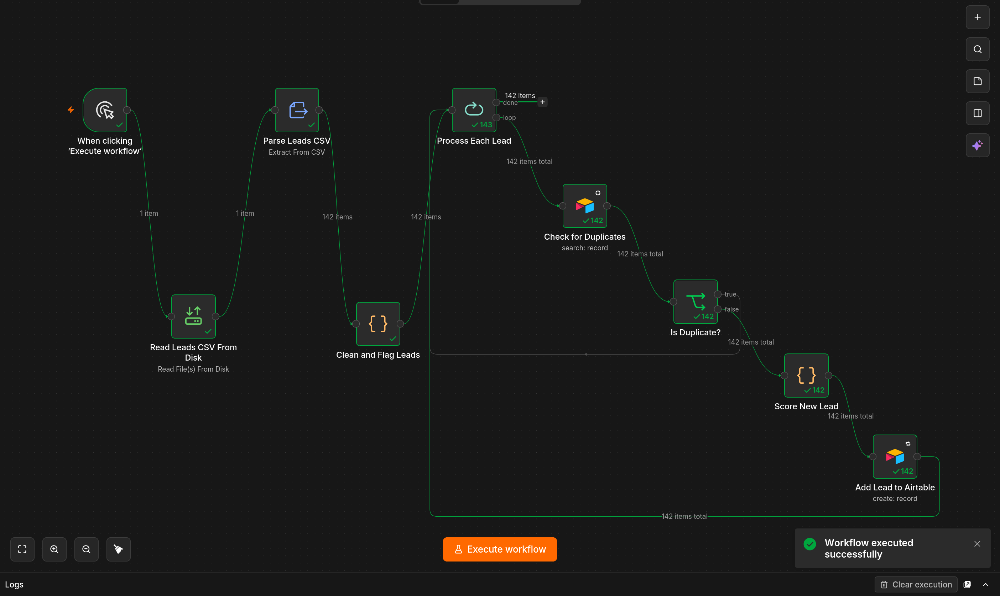
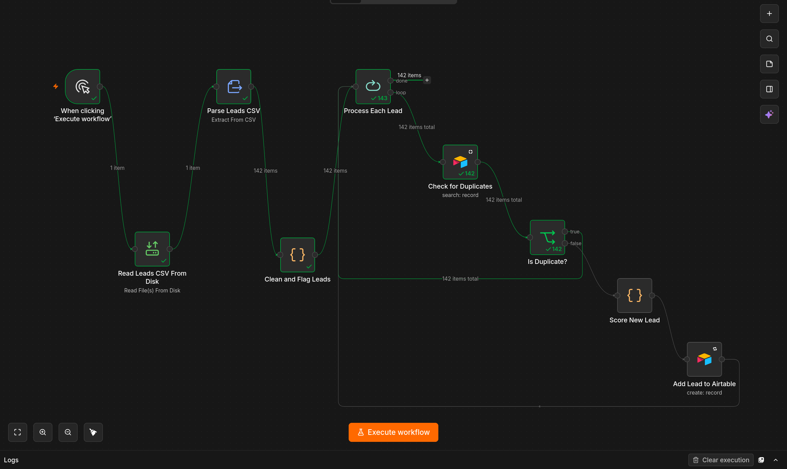

# Switchyard

An n8n workflow that ingests [leadhound](https://github.com/maniesh-lab/leadhound)'s
scraped lead CSV, cleans and normalizes it, deduplicates it against an
Airtable base, scores each lead, and writes new leads in — built to be safely
rerunnable against the same data without producing duplicates, not a one-off
import script.

Built as the second project in a lead-gen automation pipeline (scraper → n8n
routing → lead scoring → CRM hookup) — this is the routing, scoring, and CRM
hookup stage.



---

## What it does

Takes `leads.csv`, the output of leadhound's real estate agent scraper, and
turns it into a deduplicated, scored, CRM-ready Airtable table. For each row,
it normalizes the phone number into a single consistent format, coerces
messy numeric fields, checks Airtable for an existing lead at the same name
and address, skips it if found, and otherwise scores and inserts it as a new
record.

---

## Features

- CSV → structured n8n items via `Extract From File`, not manual parsing
- Phone number normalization across four real-world formats found in the raw
  scrape (`00977` international prefix, `977` country code without leading
  zeros, domestic trunk `0`-prefix, bare 10-digit mobile) — anything else is
  preserved as-is rather than guessed wrong
- Ambiguous rows are **flagged, not dropped** — a missing or unrecognized
  phone format sets `Needs Review` + a human-readable `Review Note`, so bad
  data surfaces in Airtable instead of silently failing or vanishing
- Numeric fields (`established_year`, `years_with_us`, `rating`,
  `review_count`) are coerced from messy scraped text (e.g. `"+9"` → `9`)
  before being sent to Airtable, so type mismatches don't break the run
- Duplicate detection matches on **name + address**, not name alone —
  avoids incorrectly merging two branches of the same company
- Idempotent by design — rerunning against an unchanged CSV creates zero new
  records; verified by running the full 142-row dataset twice in a row
- Transparent lead scoring (`+2` verified, `+1` rating ≥ 4, `+1` has phone)
  computed per lead before insert
- Typecast enabled on the Airtable write node as a fallback safety net

---

## Project Structure

```
Switchyard/
│
├── workflows/
│   └── Switchyard.json             # exported n8n workflow
├── Screenshots/
│   ├── workflow-canvas.png         # full node graph
│   ├── airtable-left-columns.png   # name, address, phone, etc.
│   ├── airtable-right-columns.png  # Score, Dedup Status, Needs Review, etc.
│   ├── run1-all-new.png            # first run: all leads new
│   └── run2-all-duplicate.png      # second run: all leads skipped
├── docker-compose.yml               # self-hosted n8n instance
├── .gitignore
├── LICENSE
└── README.md
```

Credentials, the Airtable Personal Access Token, and the CSV input path are
intentionally not stored in this repo — see [Setup](#how-to-run).

---

## How It Works

1. **Trigger** — manual trigger (`When clicking 'Execute workflow'`); no
   schedule or webhook yet (see Limitations)
2. **Read** — `Read Leads CSV From Disk` reads leadhound's output file from
   disk as binary
3. **Parse** — `Parse Leads CSV` (Extract From File, CSV mode) converts the
   binary into one n8n item per row
4. **Clean & Flag** — a Code node trims whitespace on every field, normalizes
   phone numbers, drops rows with no `name`, and flags rows with a missing or
   unrecognized phone format via `needs_review` / `review_note`
5. **Loop** — `Process Each Lead` (Split In Batches) processes leads one at a
   time, keeping the per-lead Airtable calls sequential and rate-limit-safe
6. **Dedup check** — `Check for Duplicates` searches Airtable with a filter
   formula matching both `name` and `address`
7. **Branch** — `Is Duplicate?` routes a match straight back to the loop
   (skip); no match continues on
8. **Score** — `Score New Lead` computes the lead's score, maps scraped
   fields onto Airtable's exact column names, coerces numeric fields, and
   drops any empty values so Airtable doesn't reject blanks
9. **Write** — `Add Lead to Airtable` creates the record, Typecast on as a
   fallback
10. Loop continues until every lead has been checked and, if new, written

---

## How to Run

**1. Clone the repo**
```bash
git clone https://github.com/maniesh-lab/Switchyard
cd Switchyard
```

**2. Start n8n**
```bash
docker compose up -d
```
n8n will be available at `http://localhost:5678`.

**3. Set up Airtable**
- Create a base (e.g. "Switchyard Leads") with a table matching the schema
  below
- Generate a Personal Access Token from Airtable's developer settings

**4. Connect the credential**
In n8n, add an Airtable credential using that token.

**5. Import the workflow**
Workflows → Import from File → `workflows/Switchyard.json`

**6. Point it at your CSV**
`docker-compose.yml` bind-mounts a specific local folder into the container
and whitelists it via `N8N_RESTRICT_FILE_ACCESS_TO` (n8n blocks filesystem
access to any path not explicitly allowed). Edit the `volumes:` line to
point at wherever your leadhound output actually lives on your machine,
update `N8N_RESTRICT_FILE_ACCESS_TO` to match the container-side path, then
restart the stack:
```bash
docker compose down
docker compose up -d
```
Finally, open `Read Leads CSV From Disk` in n8n and set `fileSelector` to
that same container-side path (e.g. `/data/leadhound/leads.csv`).

**7. Re-select your Base/Table**
Open `Check for Duplicates` and `Add Lead to Airtable` and re-pick your
Base/Table so the nodes bind to your Airtable IDs rather than the original
author's.

**8. Run it**
Click **Execute workflow**.

### Airtable schema required

| Column | Type |
|---|---|
| company_id | Single line text |
| name | Single line text |
| profile_url | Single line text |
| address | Single line text |
| tagline | Single line text |
| phone | Single line text |
| established_year | Number (integer) |
| years_with_us | Number (integer) |
| rating | Number (1 decimal) |
| review_count | Number (integer) |
| source_url | Single line text |
| scraped_at | Created time (Airtable auto-field — not written by n8n; see note below) |
| Score | Number (integer) |
| Dedup Status | Single select (`New`, `Duplicate`) |
| Needs Review | Checkbox |
| Review Note | Single line text |
| Date Added | Date, with time |

> **Note:** leadhound's own `scraped_at` value (when the lead was originally
> scraped) is not currently carried through into Airtable. The `scraped_at`
> column here is an Airtable "Created time" field that auto-stamps when the
> record is inserted — it reflects when Switchyard ran, not when leadhound
> scraped the row.

---

## Output

From leadhound's raw CSV:
```
phone: 977-1-4416941/43
established_year: 2017
years_with_us: +9
verified: True
rating: 5.0
```

Lands in Airtable as:

| Field | Value |
|---|---|
| phone | `+977-1441694143` |
| established_year | `2017` |
| years_with_us | `9` |
| Score | `4` (verified +2, rating ≥ 4 +1, has phone +1) |
| Dedup Status | `New` |
| Needs Review | unchecked |

The identity and contact fields, as they land after cleaning:



The computed fields — score, dedup status, and the review flag catching a
row with an unrecognized phone format:



---

## Verifying Idempotency

Running the workflow twice against the same CSV should create zero new
records on the second pass. Tested against the full 142-row dataset:

**Run 1** — every lead is new, so all 142 items flow through the `false`
(not-a-duplicate) branch into scoring and creation:



**Run 2** — same CSV, run again immediately after. Every lead now matches an
existing `name` + `address` pair in Airtable, so all 142 items flow through
the `true` (duplicate) branch straight back to the loop. `Score New Lead`
and `Add Lead to Airtable` process zero items:



---

## Tech Stack

| Tool | Purpose |
|---|---|
| n8n | Workflow engine — parsing, cleaning, looping, branching |
| Docker Compose | Self-hosted n8n instance |
| Airtable | Destination store and dedup source of truth |
| Airtable Personal Access Token | Auth between n8n and Airtable |

---

## Known Limitations

Listed deliberately, not hidden:

- **No scheduling or webhook trigger.** Runs are started manually via
  "Execute workflow"; not yet wired to fire automatically when leadhound
  produces a new CSV.
- **Duplicates are skipped, not refreshed.** If a lead's data changes
  upstream (say, a new rating) but name and address stay the same, the
  existing Airtable record is left untouched instead of updated. An
  update-mode branch is a natural next step, not yet built.
- **Dedup match is exact-string, not fuzzy.** A name or address differing
  even by punctuation or spacing won't match and will insert as a second
  record. This is a deliberate tradeoff — fuzzy matching risks false-positive
  merges of two different businesses — but it means dedup can still be
  defeated by inconsistent scraped formatting.
- **The CSV file path is hardcoded** to a local disk path in both
  `docker-compose.yml`'s volume mount and `Read Leads CSV From Disk`'s
  `fileSelector` — not parameterized. Running this on a different machine
  requires updating both.
- **leadhound's own `scraped_at` timestamp isn't carried into Airtable.**
  The `scraped_at` column in Airtable is auto-generated on record creation
  instead — see the note under the schema table.
- **Airtable rate limits shape the design.** Leads are processed one at a
  time specifically to stay under Airtable's request limits, which makes
  large batches slower than a bulk import would be.
- **Credentials aren't portable.** The Airtable PAT lives in the local n8n
  instance's credential store, not in this repo by design — importing the
  workflow elsewhere requires re-adding the credential.

---

## Legal / Ethical Notes

- This workflow fetches nothing on its own — it operates entirely on
  leadhound's already-scraped, `robots.txt`-respecting output
- Airtable writes only ever add new records; nothing in this workflow
  deletes or overwrites existing Airtable data

---

## Use Case

The middle stage of a lead-gen pipeline: takes leadhound's raw scraped CSV
and turns it into a deduplicated, scored, CRM-ready Airtable table — ready
for outreach or a follow-up automation, without manual copy-pasting or
duplicate-checking.

---

## Author

**Manish Pandeya** · [github.com/maniesh-lab](https://github.com/maniesh-lab)